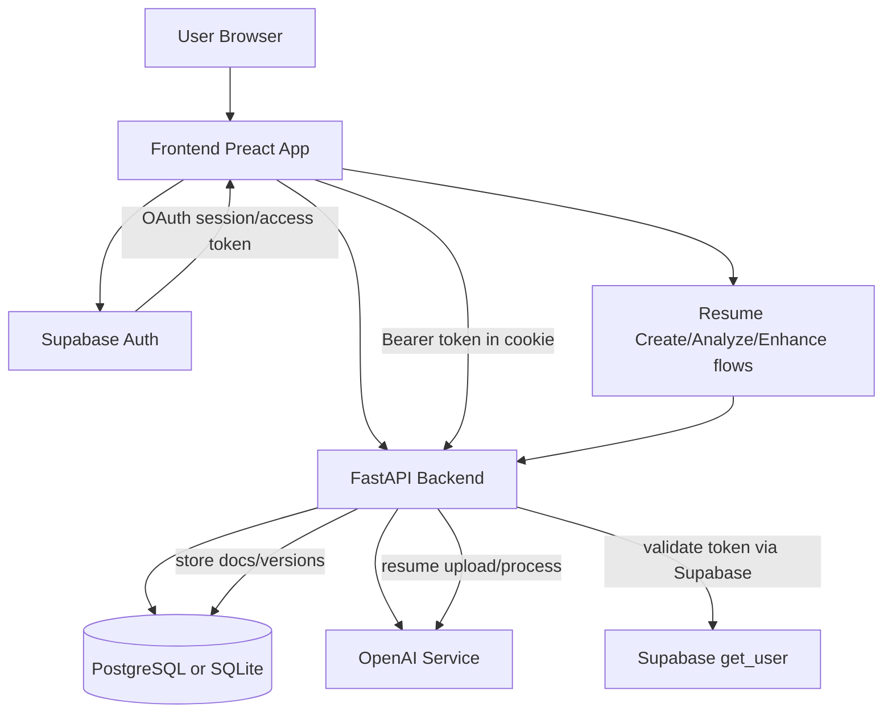
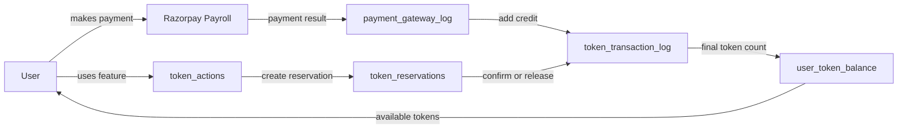

<div align="center">
  

  <p>AI-powered resume builder and ATS optimization platform</p>

  <a href="https://opensource.org/licenses/MIT">
    
  </a>
  <a href="CONTRIBUTING.md">
    
  </a>
  <a href="https://github.com/gauravsinhaweb/whatthecv/issues">
    
  </a>
  <a href="https://github.com/gauravsinhaweb/whatthecv/stargazers">
    
  </a>
  <a href="https://buymeacoffee.com/gauravsinha">
    
  </a>
</div>

## Overview

WhatTheCV helps job seekers create professionally designed resumes that are optimized to pass through Applicant Tracking Systems, while also providing tools for recruiters to find ideal candidates. Our AI-powered platform offers intelligent feedback, job-specific tailoring, and professional templates.

## Why I Built WhatTheCV

When I was hiring an intern for our company, most applicants were 3rd and 4th year graduates. I noticed a repeated pattern in many resumes: common and unnecessary keywords such as "leadership qualities" and other generic claims that were not aligned with professional job descriptions.

That gap inspired me to build WhatTheCV, an AI-powered platform that helps candidates improve their existing resumes, align content with real company JD requirements, and present their experience in a clearer, more professional way.

## Getting Started

### Prerequisites

- Node.js (v16 or later)
- npm or pnpm (pnpm recommended)

### Installation

1. Clone the repository:

   ```
   git clone https://github.com/gauravsinhaweb/whatthecv.git
   ```

2. Navigate to the project directory:

   ```
   cd whatthecv
   ```

3. Install dependencies:

   ```
   pnpm install
   ```

   or

   ```
   npm install
   ```

4. Start the development server:

   ```
   pnpm dev
   ```

   or

   ```
   npm run dev
   ```

5. Open your browser and navigate to `http://localhost:3000`

## Technology Stack

- **Frontend**: Preact, TypeScript, Tailwind CSS
- **Backend**: Python FastAPI
- **Deployments**: Docker
- **UI Components**: Custom components with Tailwind styling
- **Icons**: Lucide React
- **State Management**: React Hooks
- **Animations**: CSS Transitions and Transforms

## Project Structure

```
whatthecv/
├── public/           # Static files
├── src/
│   ├── components/   # React components
│   │   ├── ui/       # Reusable UI components
│   │   ├── Dashboard.tsx   # Main dashboard component
│   │   └── ...       # Other components
│   ├── pages/        # Page components
│   ├── styles/       # Globalstyles
│   ├── utils/        # Utility functions
│   ├── types/        # TypeScript type definitions
│   └── ...           # Other source files
├── package.json      # Dependencies and scripts
└── README.md         # This file
```

## How It Works

1. **Upload Your Resume** - Upload your existing resume or start from scratch with our templates
2. **AI Analysis** - Our AI analyzes your resume for ATS compatibility and suggests improvements
3. **Optimize & Export** - Implement the suggestions, choose your privacy settings, and export your optimized resume

## System UML (Frontend + Backend)



## Internal Token Management (Auth Tokens)

- Authentication is handled with Supabase OAuth and PKCE in the frontend.
- The frontend stores the access token in cookies and attaches it as `Authorization: Bearer <token>` for API calls.
- On `401`, frontend API interceptors attempt `supabase.auth.refreshSession()` and retry requests with the refreshed token.
- Backend validates bearer tokens against Supabase and maps the Supabase user to local user records.

### Internal Token Management & Payroll UML



Token lifecycle at table level: Razorpay payroll records payment status in `payment_gateway_log`, successful payments create credit entries in `token_transaction_log`, reservations track pending usage, reservation confirmation/release writes final ledger entries, and user balance reflects final available tokens.

## Contributing

We welcome contributions from the community! Please read our [Contributing Guidelines](CONTRIBUTING.md) for details on our code of conduct and the process for submitting pull requests.

### Quick Start for Contributors

1. Fork the repository
2. Clone your fork: `git clone https://github.com/YOUR_USERNAME/whatthecv.git`
3. Create your feature branch: `git checkout -b feature/amazing-feature`
4. Make your changes
5. Commit your changes: `git commit -m 'Add some amazing feature'`
6. Push to the branch: `git push origin feature/amazing-feature`
7. Open a Pull Request

### Areas We Need Help With

- UI/UX improvements
- ATS scoring algorithm refinement
- Template designs
- Accessibility enhancements
- Test coverage
- Documentation

## Support the Project

If you find WhatTheCV useful, consider:

- ⭐ Star the repository on GitHub
- 🐛 Report bugs or suggest features through [GitHub Issues](https://github.com/gauravsinhaweb/whatthecv/issues)
- 💻 Submit pull requests to improve the codebase
- ☕ Support the development by [buying me a coffee](https://buymeacoffee.com/gauravsinha)

[](https://buymeacoffee.com/gauravsinha)

## License

This project is licensed under the MIT License - see the [LICENSE](LICENSE) file for details.

## Contact

- **Project Maintainer**: [Gaurav Sinha](https://x.com/defigoro)
- **Frontend**: [https://github.com/gauravsinhaweb/whatthecv](https://github.com/gauravsinhaweb/whatthecv)
- **Backend**: [https://github.com/gauravsinhaweb/whatthecv-backend](https://github.com/gauravsinhaweb/whatthecv-backend)
- **Issues**: [https://github.com/gauravsinhaweb/whatthecv/issues](https://github.com/gauravsinhaweb/whatthecv/issues)

## Acknowledgements

- [React](https://reactjs.org/)
- [TypeScript](https://www.typescriptlang.org/)
- [Tailwind CSS](https://tailwindcss.com/)
- [Lucide Icons](https://lucide.dev/)
- All our [contributors](https://github.com/gauravsinhaweb/whatthecv/graphs/contributors)
